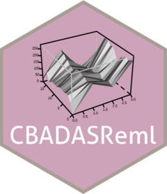

# CBADASReml 

## A collection of helper functions for small-plot trial analysis using ASReml

## Installation instructions

{CBADASReml} is available through the [R-Universe](https://aagi-aus.r-universe.dev/packages) with pre-built binaries (this is the easy way).

To get started:

### Enable this universe

```r
options(repos = c(
    aagi_aus = 'https://aagi-aus.r-universe.dev',
    CRAN = 'https://cloud.r-project.org'))
```

### Install

```r
install.packages("CBADASReml")
```

### The hard(er) way

You can install {CBADASReml} directly from the repository with {pak} like so:

```r
o <- options() # store default options

options(pkg.build_vignettes = TRUE)

if (!require("pak"))
  install.packages("pak")
pak::pak("AAGI-AUS/CBADASReml")

options(o) # reset options
```

## Usage

For a detailed understanding of how the package can be used, here is a fully worked example of a small-plot trial analysis: [Small-Plot Case Study](https://aagi-aus.github.io/CBADASReml/articles/small_plot_analysis.html)
This analysis tries to showcase each function in a useful capacity.

## Contributions

All contributions are appreciated, but please make sure to follow the [Contribution Guidelines](.github/CONTRIBUTING.md).
