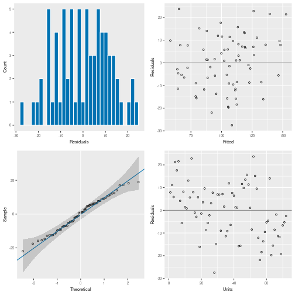

``` r
library(CBADASReml)
library(asreml)
```

# CBADASReml

## Introduction

A typical type of experimental analysis that this package will assist with is
the small plot trial. Here we will show the general workflow for performing a
small-plot analysis and how each function from the package can be used.
Analysis of small plot trials is done using linear mixed-effects models (LMMs),
using `ASReml` or `glmmTMB`, and this package contains helper functions for
this type of modelling.

Note that the trial design is not handled at all by this package, and we
recommend the use of [{FielDHub}](https://didiermurillof.github.io/FielDHub/index.html)
for creating small plot trial designs.

## Mathematical Background

Let:

\begin{equation*}
y
=
X b
+
Z u
+
e
\end{equation*}

Where

- $y \in \mathbb{R}^{n}$ is the vector of observations.
- $b \in \mathbb{R}^{p}$ is the vector of fixed effects.
- $X \in \mathbb{R}^{n \times p}$ is the design matrix for the fixed effects.
- $u \in \mathbb{R}^{q}$ is the vector of random effects.
- $Z \in \mathbb{R}^{n \times q}$ is the design matrix for the random effects.
- $e \in \mathbb{R}^{n}$ is the vector of residuals.

It is assumed that the vectors $u$ and $e$ are independent, and their joint
distribution is a multivariate Gaussian described by:

\begin{equation*}
\begin{bmatrix}
u \\
e
\end{bmatrix}
\sim
N \bigg(
  \begin{bmatrix}
  0 \\
  0
  \end{bmatrix}
  ,
  \begin{bmatrix}
  G & 0 \\
  0 & R
  \end{bmatrix}
\bigg)
\end{equation*}

Where $G$ and $R$ are covariance matrices for $u$ and $e$ and are functions of
the *variance parameters* $\sigma_g$ and $\sigma_r$, and finally the dependent
variable $y$ is described by:

\begin{equation*}
y
\sim
N \big(
X b
,
Z G Z^\intercal
+
R
\big)
\end{equation*}

These $G$ and $R$ covariance matrices, or *covariance structures*, are very
important. These represent the way the random effects and the residuals behave,
and $\sigma_g$ and $\sigma_r$, the *covariance structure parameters* are the
things we try and estimate when we use ASReml.

In the case of independent and identically distributed (IID) residual
structures, the residual covariance parameter $\sigma_r$ will be some *variance
component* $\sigma_e^2$.

### Exploratory Data Analysis

After gathering data from an experiment, it is useful to perform an exploratory
data analysis on the raw data, and for this you will likely use a combination
of `tidyverse` and `gplot2` for this, to visualise outliers, the data
distribution, etc. in order to get a preliminary grasp of what you are working
with, and to observe the data for any issues that will hinder the actual
analysis. As an assistance with this process, the function `exploratory_table`
is provided.


``` r
CBADASReml::exploratory_table(
    data = oats,
    response = "yield",
    groupby = c("Variety", "Nitrogen")
)
#>        Variety Nitrogen             mean median               sd
#> 1  Golden_rain    0_cwt               80     75 21.0047613649858
#> 2  Golden_rain  0.2_cwt             98.5  102.5 13.4721935853075
#> 3  Golden_rain  0.4_cwt 114.666666666667    110 29.9443929086343
#> 4  Golden_rain  0.6_cwt 124.833333333333  129.5 20.8750249500849
#> 5   Marvellous    0_cwt 86.6666666666667   92.5 16.5730705262081
#> 6   Marvellous  0.2_cwt            108.5  111.5 26.8533051969399
#> 7   Marvellous  0.4_cwt 117.166666666667  118.5 9.78604448521805
#> 8   Marvellous  0.6_cwt 126.833333333333  122.5 20.2920345620311
#> 9      Victory    0_cwt             71.5     65   20.59854363784
#> 10     Victory  0.2_cwt 89.6666666666667   89.5 22.5092573548455
#> 11     Victory  0.4_cwt 110.833333333333    106 26.0108951531213
#> 12     Victory  0.6_cwt            118.5  114.5 30.0915270466622
#>                  cv reps min max     range
#> 1  26.2559517062322    6  60 117  60 - 117
#> 2  13.6773538937132    6  82 114  82 - 114
#> 3  26.1142961412508    6  86 161  86 - 161
#> 4  16.7223163819105    6  96 149  96 - 149
#> 5  19.1227736840862    6  63 105  63 - 105
#> 6  24.7495900432626    6  70 140  70 - 140
#> 7  8.35224280388454    6 104 132 104 - 132
#> 8  15.9989760016014    6  99 156  99 - 156
#> 9   28.809151941035    6  53 111  53 - 111
#> 10  25.103260990534    6  64 130  64 - 130
#> 11 23.4684768298838    6  81 157  81 - 157
#> 12 25.3936937102634    6  86 174  86 - 174
```

### Model Fitting and Validation

We may use the R package `asreml` as follows to implement an LMM. For the purpose
of this vignette we will fit a few different models, so we can demonstrate
different techniques from the package.


``` r
# The needs to be ordered so that the model can run
oats <- oats[order(oats$Column), ]

mod_oats <- asreml(
    fixed = yield ~ Variety + Nitrogen + Variety:Nitrogen,
    random = ~ idv(Blocks) + idv(Blocks):id(Wplots),
    residual = ~ ar1(Column):ar1(Row),
    data = oats,
    trace = FALSE
)
#> Warning in asreml(fixed = yield ~ Variety + Nitrogen + Variety:Nitrogen, : Some
#> components changed by more than 1% on the last iteration

mod_oats <- update(mod_oats, aom = TRUE)

mod_rats <- asreml(
    fixed = weight ~ littersize + Sex + Dose,
    random = ~idv(Dam),
    residual = ~units,
    data = rats,
    trace = FALSE
)

mod_rats <- update(mod_rats, aom = TRUE)
```

In the first model, `mod_oats`, we are using the `oats` data:

##### Data
- The `oats` data has 72 rows, 2 treatments (Nitrogen and Variety), and plots
  (3 levels) within blocks (6 levels). Therefore:
  + $n = 72$ (number of observations)
  + $p = 3$ (number of fixed effects, including an interaction effect)
  + $q = 2$ (number of random effects, blocks, and plots within blocks)

##### $y$
- `yield` is our $y \in \mathbb{R}^{72}$ ($72 \times 1$) vector.

##### $X$
- `Variety`, `Nitrogen` and their interaction `Variety:Nitrogen` are in the $X
  \in \mathbb{R}^{72 \times 3}$ ($72 \times 3$) matrix.

##### $b$
- There are 3 fixed effects which are continuous, therefore our fixed effects
  vector is given by $b \in \mathbb{R}^{3 \times 1}$

##### $Z$
- `Blocks` and `Blocks:Wplots` make up our $Z \in \mathbb{R}^{n \times q}$
  matrix. Since these are factors, each level is treated as it's own dummy
  variable. We end up with two $Z_i$ matrices which make up $Z = [ \; Z_1 \; Z_2
  \; ]$ which are given as follows (if ordered by their respective variables):

\begin{equation*}
Z_{1}
=
\begin{bmatrix}
1          & 0 & 0 & 0 & 0 & 0 \\
\vdots \times \text{10} & 0 & 0 & 0 & 0 & 0 \\
1          & 0 & 0 & 0 & 0 & 0 \\
0          & 1 & 0 & 0 & 0 & 0 \\
0          & \vdots \times \text{11} & 0 & 0 & 0 & 0 \\
           &   & \vdots &   &   &
\end{bmatrix}
\in
\mathbb{R}^{72 \times 6}
\end{equation*}

\begin{equation*}
Z_{2}
=
\begin{bmatrix}
1 & 0 & 0 & 0 & 0 & 0 & 0 & 0 & 0 & 0 & 0 & 0 & 0 & 0 & 0 & 0 & 0 & 0 \\
\vdots \times \text{2} & 0 & 0 & 0 & 0 & 0 & 0 & 0 & 0 & 0 & 0 & 0 & 0 & 0 & 0 & 0 & 0 & 0 \\
1 & 0 & 0 & 0 & 0 & 0 & 0 & 0 & 0 & 0 & 0 & 0 & 0 & 0 & 0 & 0 & 0 & 0 \\
0 & 1 & 0 & 0 & 0 & 0 & 0 & 0 & 0 & 0 & 0 & 0 & 0 & 0 & 0 & 0 & 0 & 0 \\
0 & \vdots \times \text{2} & 0 & 0 & 0 & 0 & 0 & 0 & 0 & 0 & 0 & 0 & 0 & 0 & 0 & 0 & 0 & 0 \\
&  &  &  &  &  &  &  & \vdots &  &  &  &  &  &  &  &  &
\end{bmatrix}
\in
\mathbb{R}^{72 \times 18}
\end{equation*}

  Where each column in $Z_1$ represents the $6$ `Blocks`, and the columns in
  $Z_2$ represent the $6 \times 3 = 18$ `Blocks` $\times$ `Wplots`.

##### $u$
- Since we have $2$ model terms (`idv(Blocks)` and `idv(Blocks):id(Wplots)`),
  we have two $Z_i$ matrices, and also two $u_i$ vectors. Our random effects
  vector is given by:
  + $u = \begin{bmatrix} u_1 \\ u_2 \end{bmatrix}$
  + $u_1 \sim N(0, G_1) \in \mathbb{R}^{6}$
  + $u_2 \sim N(0, G_2) \in \mathbb{R}^{18}$.

##### $G$
- `idv(Blocks) + idv(Blocks):id(Wplots)` is the random effects variance
  structure. Since we have two terms, we again have two $G_i$'s. We specify the
  `idv` variance model function, which is the homogeneous scaled identity
  variance structure, i.e. $\sigma^2 I$. The second term has a /direct product/
  implied by the `:` operator, which in the case of matrices is a /Kronecker
  product/, of `idv(Blocks)` and `id(Wplots)`. `id` variance model means it is
  simply a correlation structure, i.e. $I$, and there is no estimation of a
  variance parameter. Noting we have 2 random effects terms:
  + $G_1 = \sigma_1^2 I_6$ ($I_6$ is the $6 \times 6$ identity matrix)
  + $G_2 = (\sigma_2^2 I_6) \otimes I_3$
  + $G = \bigoplus_{i = 1}^2 G_i = \begin{bmatrix} \sigma_1^2 I_6 & 0 \\ 0 &
    (\sigma_2^2 I_6 \otimes I_3) \end{bmatrix}$

##### $e$
- The error vector is specified by the single model term
  `ar1(Column):ar1(Row)`, therefore the error is given by:
  + $e \sim N(0, R)$ where $R$ is the $R$ structure

##### $R$
- `ar1(Column):ar1(Row)` specifies the residual variance structure. In this
  case we refer to an autoregressive model of order 1 (AR(1)) on both `Row` and
  `Column`, where the `:` operator implies a separable Kronecker product
  structure. The variance model `ar1` is of the form: $\Sigma_{ii} = 1,
  \Sigma_{ij} = \phi \Sigma_{i-1, j}, i > j+1, \lvert \phi \rvert < 1$.
  + $R = \Sigma_c(\phi_c) \otimes \Sigma_r(\phi_r)$
  + Where $\phi$ refers to the correlation within the columns ($\phi_c$) or the
    rows ($\phi_r$).

In the second model, `mod_rats`, we are using the `rats` data:

- `weight` is our $y$ vector.
- `littersize`, `Sex` and `Dose` are in the $X$ matrix.
- `Dam` is in the $Z$ matrix. We specify the `idv` variance model function,
  which is the homogeneous scaled identity variance structure, i.e. $\sigma^2
  I$. In other words, the term is IID:
  + $u \in \mathbb{R}^d \sim N(0, G)$
  + $Z$ is the design matrix for `Dam`.
  + $G = \sigma_d^2 I_d$.
- `idv(units)` is the residual variance structure, in this case the residual
  term has the homogeneous covariance matrix: $\sigma^2 I$. This is basically
  saying all observations have the same error distribution (IID):
  + $e \in \mathbb{R}^n \sim N(0, R)$
  + $R = \sigma_e^2 I_n$

Upon executing the above in R, the `ASReml-R` code will attempt to
*estimate* the variance components $\sigma_d^2$ and $\sigma_e^2$, using the
REML algorithm.

## Function examples

::::{style="display: grid; grid-template-columns: 1fr 1fr; grid-column-gap: 10px"}

:::{}

### Traditional Diagnostics (`ASReml-R`)

#### `plot.asreml`

``` r
plot(mod_oats)
```



#### `plot(varioGram(mod))`

``` r
plot(varioGram(mod_oats))
```


:::

:::{}

### CBADASReml Diagnostics

#### `outlier_summary`

The purpose of the `outlier_summary` function is to observe potential outliers
that can then be discussed with the data provider. Below is an example for the
rats dataset that is included within `ASReml-R`.


``` r
outlier_summary(mod_rats)
#> [1] "Outliers detected: 2"
#>    Dose Sex littersize Dam weight units combined_trt residuals
#> 56    C   F         13   5   5.02    56       13_F_C -4.090506
#> 66    C   F          9   6   3.68    66        9_F_C -7.941340
#>     Dose Sex littersize Dam weight units combined_trt  residuals
#> 56     C   F         13   5   5.02    56       13_F_C -4.0905065
#> 57     C   F         13   5   6.04    57       13_F_C -1.4769901
#> 53     C   F         13   5   7.16    53       13_F_C  1.3927533
#> 55     C   F         13   5   7.14    55       13_F_C  1.3415079
#> 54     C   F         13   5   7.09    54       13_F_C  1.2133944
#> 129    C   F         13  10   5.92   129       13_F_C -1.1145276
#> 126    C   F         13  10   6.67   126       13_F_C  0.8050510
#> 128    C   F         13  10   6.53   128       13_F_C  0.4467297
#> 130    C   F         13  10   6.52   130       13_F_C  0.4211353
#> 125    C   F         13  10   6.44   125       13_F_C  0.2163802
#> 131    C   F         13  10   6.44   131       13_F_C  0.2163802
#> 127    C   F         13  10   6.43   127       13_F_C  0.1907859
#> 66     C   F          9   6   3.68    66        9_F_C -7.9413397
#> 64     C   F          9   6   7.26    64        9_F_C  1.3727706
#> 65     C   F          9   6   6.58    65        9_F_C -0.3963900
```

#### `directional_variograms`

The purpose of this function is to view the autocorrelation structure in both
directions, rather than the traditional approach with `ASReml-R`.


``` r
plot(directional_variograms(mod_oats))
```


:::

::::


## Model Outputs

::::{style="display: grid; grid-template-columns: 1fr 1fr; grid-column-gap: 10px"}

:::{}

### Traditional Outputs (`ASReml-R`)

#### `wald`

For getting the significance of each variable in the model


``` r
wald(mod_rats)
#> Wald tests for fixed effects.
#> Response: weight
#> Terms added sequentially; adjusted for those above.
#> 
#>               Df Sum of Sq Wald statistic             Pr(Chisq)    
#> (Intercept)    1   1477.67         8981.5 < 0.00000000000000022 ***
#> littersize     1      4.58           27.8   0.00000013118965070 ***
#> Sex            1      9.80           59.5   0.00000000000001199 ***
#> Dose           2      3.76           22.8   0.00001099619080491 ***
#> residual (MS)         0.16                                         
#> ---
#> Signif. codes:  0 '***' 0.001 '**' 0.01 '*' 0.05 '.' 0.1 ' ' 1
```

#### `predict`


``` r
predict.asreml(mod_oats, classify = "Nitrogen")
#> $pvals
#> 
#> Notes:
#> - The predictions are obtained by averaging across the hypertable
#>   calculated from model terms constructed solely from factors in
#>   the averaging and classify sets.
#> - Use 'average' to move ignored factors into the averaging set.
#> - The simple averaging set: Variety
#> - The ignored set: Blocks,Wplots
#> 
#>   Nitrogen predicted.value std.error    status
#> 1    0_cwt        77.76388  6.929776 Estimable
#> 2  0.2_cwt       100.15097  6.896569 Estimable
#> 3  0.4_cwt       114.41044  6.887489 Estimable
#> 4  0.6_cwt       123.22901  6.912904 Estimable
#> 
#> $avsed
#>  overall 
#> 3.748427
```

:::

:::{}

### CBADASReml Outputs

### `anova_table`

Show an ANOVA table for multiple models, with p-values for each effect against
each response.


``` r
rats[["newresp"]] <- rats[["weight"]] * runif(nrow(rats))

mod_rats2 <- asreml(
    fixed = newresp ~ littersize + Sex + Dose,
    random = ~idv(Dam),
    residual = ~units,
    data = rats,
    trace = FALSE
)

mod_rats2 <- update(mod_rats2, aom = TRUE)

anova_table(mod_rats, mod_rats2)
#>       Effect weight newresp
#> 1 littersize      0   0.134
#> 2        Sex      0   0.209
#> 3       Dose      0   0.869
```

### `pred_table`

Get the mean for each level of a fixed effect, as well as standard error, and
confidence intervals.


``` r
pred_table(mod_rats, classify = "Dose")
#> Warning in asremlPlus::predictPlus.asreml(mod, classify = classify, wald.tab =
#> as.data.frame(asreml::wald(mod)), : Denominator degrees of freedom obtained
#> using dDF.na method residual
#>   Treatment     Mean Standard Error Lower CL Upper CL
#> 1         C 6.410370      0.1060763 6.201667 6.619072
#> 2      High 5.554064      0.1482309 5.262423 5.845704
#> 3       Low 5.989315      0.1071587 5.778483 6.200147
```

:::

::::

## Least significant difference

#### `lsd_table`

Show a least significant difference table:


``` r
lsd_table(mod_rats, classify = "Dose")
#>   treatment group      lsd    means
#> 1         C     a 0.354997 6.410370
#> 2       Low     b 0.354997 5.989315
#> 3      High     c 0.354997 5.554064
```

#### `lsd_graph`

Show an LSD graph of the same data:


``` r
lsd_graph(mod_rats, classify = "Dose")
```


